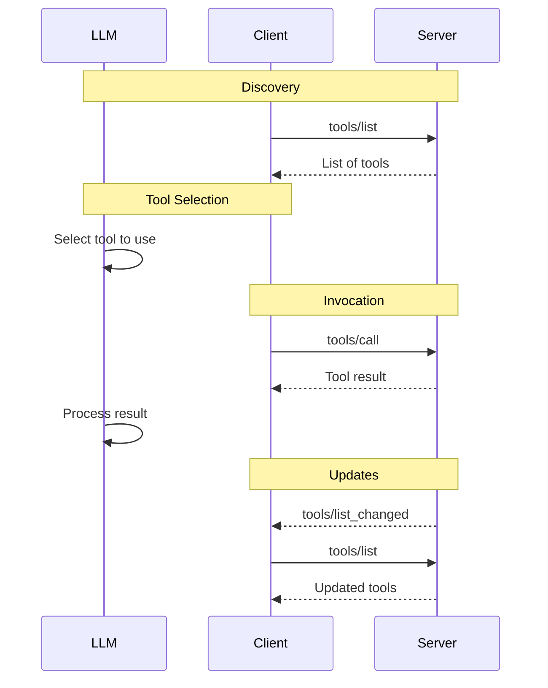
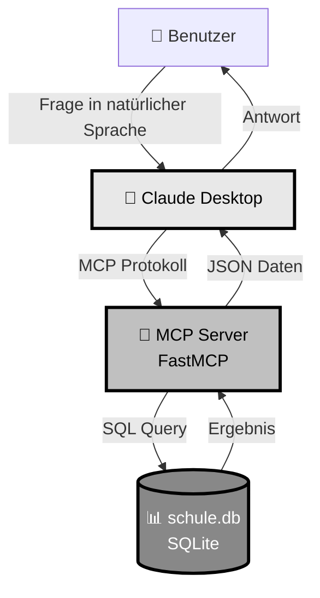
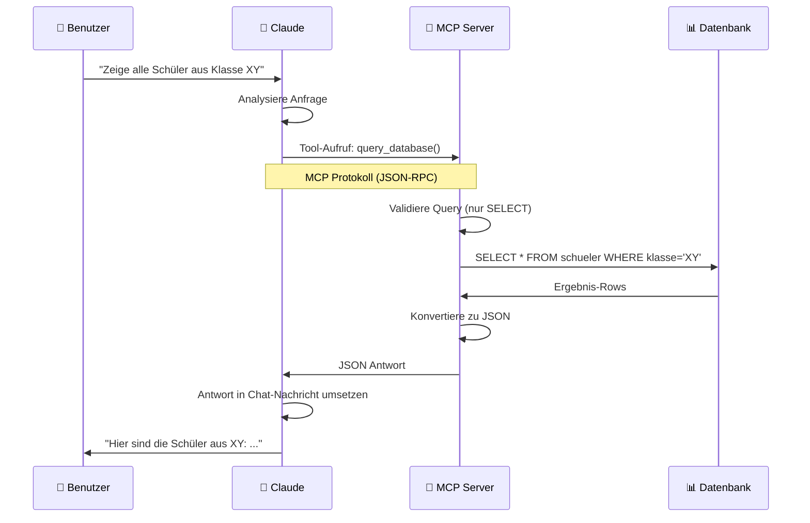

# SQLite MCP Server Projekt (FastMCP)

Ein Projekt zum Lernen, wie man eine SQLite-Datenbank mit einem LLM über einen MCP-Server abfragt. Verwendet FastMCP für eine einfache Python-Implementierung.

## Was ist MCP?

Das **Model Context Protocol (MCP)** ist ein offener Standard, der es Large Language Models (LLMs) ermöglicht, mit externen Datenquellen und Tools zu kommunizieren. In diesem Projekt nutzen wir MCP, um einem LLM Zugriff auf eine SQLite-Datenbank zu geben.

## Übersicht: Wie funktioniert das System?

Der Anfrager (i.d.R. das Programm, in dem die KI (LLM) läuft) kann 
- eine Übersicht der Werkzeuge eines MCP-Servers anfragen: Der Client fragt den/die Server ab, welche Tools sie zur Verfügung stellen. Die Protocol Message Method dazu ist [`tools/list`](https://modelcontextprotocol.io/specification/2025-03-26/server/tools#listing-tools)

- Werkzeuge verwenden: Danach kann der Client die Tools nutzen, indem er eine [`tools/call`](https://modelcontextprotocol.io/specification/2025-03-26/server/tools#calling-tools) Methode.

- (Änderungen auflisten lassen) [`tools/list_changed`](https://modelcontextprotocol.io/specification/2025-03-26/server/tools#list-changed-notification)

### MCP Protokoll-Ablauf (nach [https://modelcontextprotocol.io/specification/2025-03-26/server/tools#message-flow](https://modelcontextprotocol.io/specification/2025-03-26/server/tools#message-flow))



Antworten des Servers werden per JSON RPC als Tool Result übertragen.
Das können Text, Audio, Bild oder Embedded sein.

Hier das Beispiel Text nach [https://modelcontextprotocol.io/specification/2025-03-26/server/tools#text-content](https://modelcontextprotocol.io/specification/2025-03-26/server/tools#text-content)
```json
{
  "type": "text",
  "text": "Tool result text"
}
```




## Kommunikationsfluss im Detail




## Projektstruktur

```
sqlite-mcp/
├── src/
│   └── index.py          # Der MCP-Server Code (Python)
├── create_database.py    # Script zum Initialisieren der Datenbank
├── requirements.txt      # Python Abhängigkeiten
├── pyproject.toml        # Python Projekt-Konfiguration
└── schule.db            # Die SQLite-Datenbank (wird erstellt)
```

## Die Beispiel-Datenbank

Die Datenbank `schule.db` enthält vier Tabellen:

### 1. **schueler**
- Enthält Informationen über Schüler (Name, Klasse, Geburtsdatum, Email)
- 10 Beispiel-Schüler aus verschiedenen Klassen

### 2. **lehrer**
- Informationen über Lehrer (Name, Fach, Raum)
- 5 Lehrer mit verschiedenen Fächern

### 3. **kurse**
- Kursinformationen (Name, Lehrer, Raum, Zeitplan)
- 5 verschiedene Kurse

### 4. **noten**
- Noten von Schülern in verschiedenen Kursen
- Verschiedene Arten: Klausuren, mündliche Noten, Hausaufgaben

# Installationsanleitung: SQLite MCP Server (FastMCP)

## Schnellstart-Anleitung

### 0. Git-Repo Clonen
Öffne PowerShell im Projektordner **mit Admin-Rechten** und führe aus:
```powershell
git clone https://github.com/FlowTheTensor/SQLite-mit-MCP.git
cd SQLite-mit-MCP
```

### 1. Virtuelle Umgebung erstellen (empfohlen)

```powershell
python -m venv venv
.\venv\Scripts\Activate.ps1
```

### 2. Abhängigkeiten installieren

```powershell
pip install -r requirements.txt
```

Das installiert FastMCP und alle benötigten Python-Pakete.

### 3. Datenbank erstellen (optional, wenn keine schueler.db vorhanden)

```powershell
python create_database.py
```

Du solltest die Meldung sehen: "✓ Datenbank erfolgreich erstellt"

### 4. In Claude Desktop einbinden

**Automatische Konfiguration (empfohlen):**

Führe einfach das Konfigurations-Script aus:

```powershell
python generate_config.py
```

Das Script zeigt dir die Konfiguration an und speichert sie in `claude_desktop_config.json`.

**Dann:**
- Gehe in Claude Desktop unten Links auf dein Nutzersymbol (ggf. Fenster maximieren)
- Dort Èinstellungen`
- Unter `Entwickler` auf `Config bearbeiten`
- Öffne die Datei `claude_desktop_config.json` mit einem Texteditor
- Kopiere den Inhalt aus der generierten `claude_desktop_config.json` hinein
---

**Wichtig:** Claude Desktop benötigt **absolute Pfade** - relative Pfade funktionieren nicht!

### 5. Claude Desktop neu starten

- Schließe Claude Desktop über den Taskmanager und Starte Claude Desktop neu.
- Nun sollte der MCP-Server in Claude verfügbar sein und auf `running` stehen.

### 6. Testen

Stelle Claude eine Frage wie:
```
Welche Schüler gibt es in der Datenbank?
```

Claude sollte jetzt die Datenbank abfragen können!

## Beispiel-Fragen zum Ausprobieren

### Einfach:
- "Zeige alle Schüler"
- "Welche Lehrer gibt es?"
- "Liste alle Kurse auf"

### Mittel:
- "Zeige alle Schüler aus Klasse 10a"
- "Welche Noten hat Max Mustermann?"
- "Wer unterrichtet Informatik?"

### Fortgeschritten:
- "Berechne den Notendurchschnitt von Anna Schmidt"
- "Welche Schüler haben in Mathematik eine 1 vor dem Komma?"
- "Zeige alle Klausurnoten mit Schülernamen und Kursnamen"

## Datenbank-Struktur verstehen

Die Datenbank hat 4 Tabellen:

📚 **schueler**: Schülerinformationen
- id, vorname, nachname, klasse, geburtsdatum, email

👨‍🏫 **lehrer**: Lehrerinformationen  
- id, vorname, nachname, fach, raum

📖 **kurse**: Kursinformationen
- id, kursname, lehrer_id, raum, wochentag, uhrzeit

📝 **noten**: Noten
- id, schueler_id, kurs_id, note, datum, art

## Häufige Probleme

**Claude antwortet, aber ohne Datenbankzugriff?**
→ Server wurde nicht richtig konfiguriert oder Claude nicht neu gestartet

**"ModuleNotFoundError: No module named 'fastmcp'" Fehler?**
→ `pip install -r requirements.txt` ausführen
→ Stelle sicher, dass die venv aktiviert ist oder nutze den venv-Python-Pfad in der Konfiguration

**Datenbank leer?**
→ `python create_database.py` ausführen

**Python-Befehl nicht gefunden?**
→ Versuche `py` statt `python`
→ Stelle sicher, dass Python installiert ist

## Was passiert im Hintergrund?

1. Du stellst Claude eine Frage
2. Claude erkennt, dass es Datenbankinfos braucht
3. Claude ruft eines der Tools auf:
   - `list_tables` - Welche Tabellen gibt es?
   - `describe_table` - Wie sieht eine Tabelle aus?
   - `query_database` - SQL-Abfrage ausführen
4. Der MCP-Server führt die Abfrage aus
5. Claude bekommt das Ergebnis und antwortet dir

## Aufgaben zum Experimentieren

1. Stelle 5 verschiedene Fragen an die Datenbank
2. Lass dir die Struktur aller Tabellen zeigen
3. Frage nach dem besten Schüler in einem Fach
4. Lass Claude eine komplexe Abfrage mit mehreren Tabellen erstellen
5. Experimentiere mit Aggregationen (Durchschnitt, Anzahl, etc.)

Viel Erfolg! 🚀


